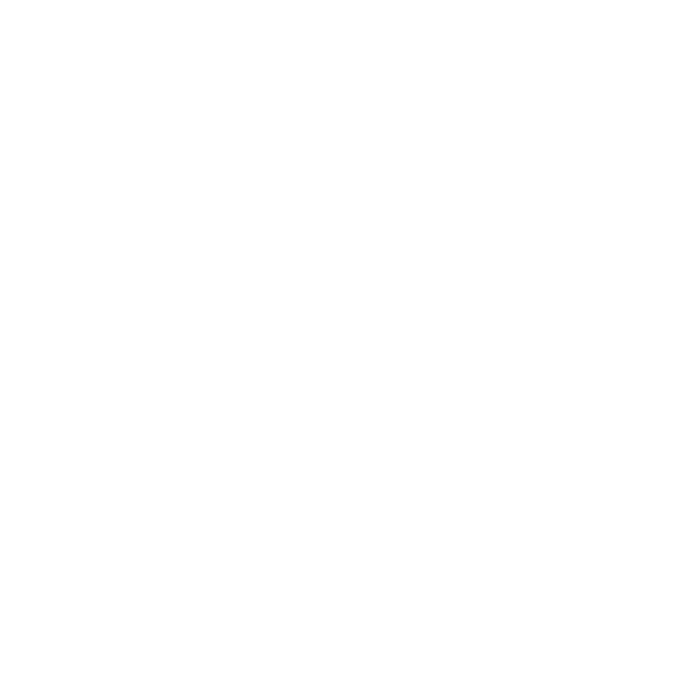

AI-powered compliance intelligence system for DPDP, GDPR, and IT Act - a chatbot with Q&amp;A and policy auditing.

# How to use
1. Clone the repo.
2. Run `PressMeToSetup.bat` - it will set up the virtual environment for you!
3. Add your API Key in the required place in `app.py`.
4. Run `venv\Scripts\activate`
5. Run `streamlit run app.py` inside the virtual environment created in step 4.

> If everything went seamlessly, you should have localhost open up on your default browser, with **Veritas A.I.** greeting you!

# Tech Stack
- **Frontend:** Streamlit  
- **LLM:** Google Gemini  
- **Embeddings:** HuggingFace (all-MiniLM-L6-v2)  
- **Vector DB:** ChromaDB  
- **Framework:** LangChain

> *Veritas* was made for a hackathon but built for the real world!

# Features present
- ***RAG-based*** legal Q&A
    - RAG (Retreival-Augmented Generation): An AI framework which improves Large Language Model (LLM) accuracy by fetching relevant, up-to-date data from external sources (documents, databases) and feeding it to the model alongside the prompt.
- ***Compliance auditor*** which evaluates how well a policy aligns with key principles of the DPDP Act (consent, purpose limitation, retention, user rights, etc.)
    - Try uploading a PDF version of the privacy policy of Google/Wikipedia/Letterboxd
- ***Query Expansion*** for more accurate prompts
- ***Multi-Source*** retreival logic so that queries using two or more documents can be serviced
- ***Text Cleaning*** so that malformed PDFs do not cause an issue
- ***Persistent Vector DataBases*** for faster loading times
- ***Query Relevance Gate***: a check put in place to dismiss irrelevant queries to save API calls (try saying "hi" or "blah blah blah" or something!)
- ***Source listing*** so that you can know exactly where the chatbot finds its information (within the contents of the PDFs in /data)

> But - we're not done yet...

# Features planned
- ***Structured compliance scoring*** for the compliance auditor
    - This will include a grade out of 100 and a comprehensive risk evaluation instead of just a blob of text
- ***Downloadable compliance reports*** so that companies can avail the use of our product
- ***Comparison Mode*** which can be used to generate tables in the chatbot's responses
- ***Cleaner UI***

> Enjoy!
